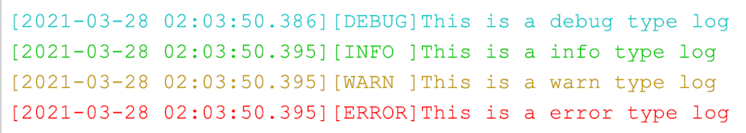
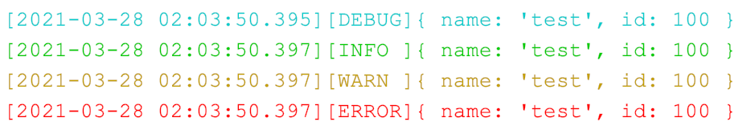
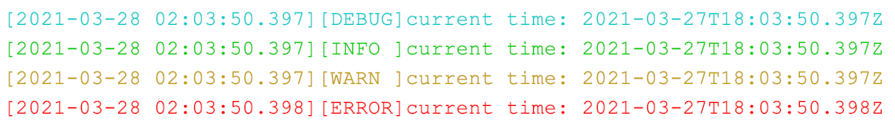

[![NPM version][npm-image]][npm-url]
[![NPM Downloads][downloads-image]][downloads-url]
[](https://github.com/xiandanin/node-console-formatter/stars)
[](https://github.com/xiandanin/node-console-formatter/blob/master/LICENSE)

[npm-image]: https://img.shields.io/npm/v/node-console-formatter.svg?style=flat-square
[npm-url]: https://www.npmjs.com/package/node-console-formatter
[downloads-image]: https://img.shields.io/npm/dm/node-console-formatter.svg
[downloads-url]: https://npmcharts.com/compare/node-console-formatter?minimal=true
[downloads-url]: https://github.com/xiandanin/node-console-formatter

[English Document](README_EN.md)

## 安装
```
npm install node-console-formatter
```

## 使用
```
// 什么也不用做，会自动替换console
require('node-console-formatter')

// 如果要输出到文件
require('node-console-formatter')('logs')
```

## 截图
```
// 仅打印文本
console.debug('This is a debug type log')
console.info('This is a info type log')
console.warn('This is a warn type log')
console.error('This is a error type log')
```


```
// 打印对象
const test = {name: 'test', id: 100}
console.debug(test)
console.info(test)
console.warn(test)
console.error(test)
```


```
// 多参数打印
console.debug('current time:', new Date())
console.info('current time:', new Date())
console.warn('current time:', new Date())
console.error('current time:', new Date())
```

