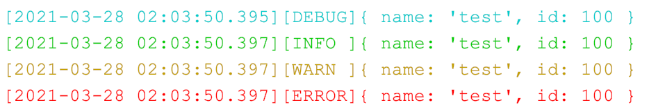
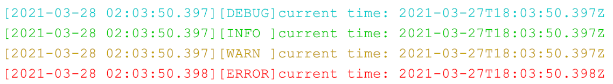

## Install
```
npm install node-console-formatter
```

## Usage
```
// No need to do anything, it will automatically replace the console
require('node-console-formatter')

// If you need to output to a file
require('node-console-formatter')(outputDir:'logs')
```

## Screenshot
```
// print text
console.debug('This is a debug type log')
console.info('This is a info type log')
console.warn('This is a warn type log')
console.error('This is a error type log')
```


```
// print object
const test = {name: 'test', id: 100}
console.debug(test)
console.info(test)
console.warn(test)
console.error(test)
```


```
// print multiple parameters
console.debug('current time:', new Date())
console.info('current time:', new Date())
console.warn('current time:', new Date())
console.error('current time:', new Date())
```

